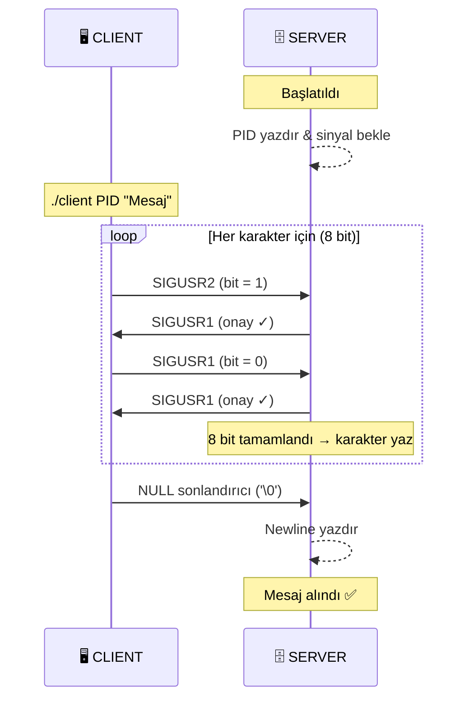

<div align="center">

[](https://en.wikipedia.org/wiki/C_(programming_language))
[](https://42kocaeli.com.tr/)
[](https://github.com/42School/norminette)
[](https://en.wikipedia.org/wiki/Unix)


**SIGUSR1 ve SIGUSR2 sinyalleri aracılığıyla iki proses arasında mesaj iletimi.**

</div>

---

## Proje Hakkında

`minitalk`, Unix sinyallerini kullanarak iki proses arasında string iletimi sağlayan bir 42 Kocaeli projesidir. Standart IPC (inter-process communication) kanalları yerine yalnızca **`SIGUSR1`** ve **`SIGUSR2`** sinyalleri kullanılır — her sinyal bir bit temsil eder.

---

## Mimari



---

## Bit Kodlama

Her karakter 8 sinyal olarak iletilir (MSB önce):

```
'A' = 01000001

Bit 7 (MSB) = 0 → SIGUSR1
Bit 6       = 1 → SIGUSR2
Bit 5       = 0 → SIGUSR1
Bit 4       = 0 → SIGUSR1
Bit 3       = 0 → SIGUSR1
Bit 2       = 0 → SIGUSR1
Bit 1       = 0 → SIGUSR1
Bit 0 (LSB) = 1 → SIGUSR2
```

Server tarafında bit birikimi:
```c
c |= 1 << (7 - recived_count);   // SIGUSR2 = bit 1
// SIGUSR1 geldiğinde hiçbir şey yapılmaz = bit 0
```

---

## Kurulum

```bash
# Klonla
git clone https://github.com/Sayicon/minitalk.git
cd minitalk

# Derle
make

# Temizlik
make clean    # .o dosyaları
make fclean   # .o + binary'ler
make re       # yeniden derle
```

---

## Kullanım

**Terminal 1 — Server'ı başlat:**
```bash
./server
# Server PID: 12345
```

**Terminal 2 — Mesaj gönder:**
```bash
./client 12345 "Merhaba, Dünya!"
# Terminal 1'de görünür: Merhaba, Dünya!
```

---

## Nasıl Çalışır?

### Server (`ft_server.c`)

1. `sigaction()` ile hem `SIGUSR1` hem `SIGUSR2` için handler kaydeder
2. `SA_SIGINFO` bayrağı sayesinde gönderenin PID'ini `si_pid` ile öğrenir
3. Her sinyal geldiğinde `ft_create_char_by_bits` çağrılır:
   - `SIGUSR2` → ilgili bit 1'e set edilir
   - `SIGUSR1` → ilgili bit 0 kalır
4. 8 bit tamamlanınca karakter yazdırılır, `'\0'` gelince `\n` basılır
5. Her bit alındığında client'a `SIGUSR1` onay sinyali gönderilir

### Client (`ft_client.c`)

1. PID argümanını doğrular
2. Her karakteri 8 bite çevirir, MSB'den başlar
3. Her bit için `kill(pid, SIGUSR1/SIGUSR2)` çağırır
4. `ft_server_affirmation` handler'ı onay sinyalini bekler (`g_signal_flag`)
5. Onay gelmeden sonraki bit gönderilmez (senkronizasyon)
6. Mesaj bittikten sonra `'\0'` karakteri iletilir

---

## Dosya Yapısı

```
minitalk/
├── ft_client.c   # Client: mesaj gönderici
├── ft_server.c   # Server: sinyal alıcı ve yazdırıcı
├── Makefile
└── README.md
```

---

## Sinyaller Hakkında

| Sinyal | Numara | Platform | Kullanım |
|--------|:------:|----------|----------|
| `SIGUSR1` | 10 | Linux / macOS | bit=0 veya onay sinyali |
| `SIGUSR2` | 12 | Linux / macOS | bit=1 |

> `SIGUSR1` ve `SIGUSR2` POSIX standardında kullanıcı tanımlı sinyallerdir. Linux ve macOS'ta yerleşik olarak mevcuttur.

### Windows Kullanıcıları İçin

`SIGUSR1` ve `SIGUSR2`, **Windows'ta doğrudan desteklenmez** (POSIX sinyalleri). Windows'ta bu projeyi çalıştırmak için seçenekler:

| Yöntem | Açıklama |
|--------|----------|
| **WSL2** (önerilen) | Windows Subsystem for Linux — tam Linux sinyal desteği |
| **Cygwin / MSYS2** | POSIX uyumluluk katmanı, `SIGUSR1`/`SIGUSR2` emüle eder |
| **Windows Signals** | `SIGBREAK` (21) ve `SIGTERM` (15) kullanılabilir fakat tam uyumlu değil |
| **Named Pipes / Mailslot** | Windows'a özgü IPC alternatifleri |

> Bu proje Unix/Linux ortamı için tasarlanmıştır. Geliştirme için WSL2 kullanılması önerilir.

---

<div align="center">

[](https://github.com/Sayicon)

</div>


